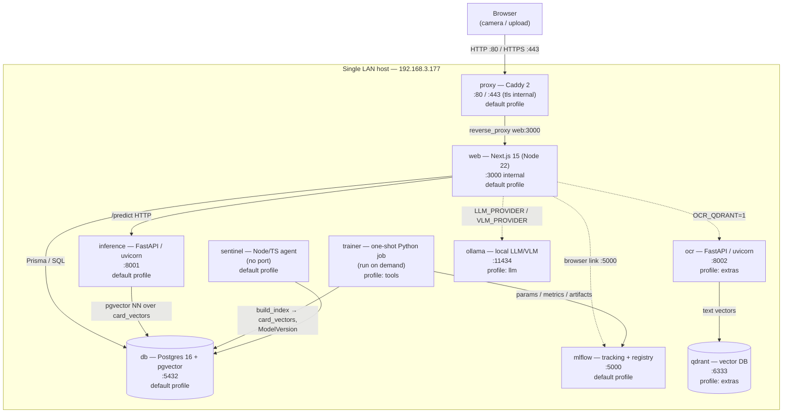

# Architecture

> Audience: project reviewer. This document describes **what** the TCG Card
> Recognizer is and **why** it is structured the way it is, grounded in the
> actual source. File paths are cited throughout so every claim can be checked.

## 1. System overview

The TCG Card Recognizer is a self-contained, multi-service application that
recognizes trading cards (Pokémon by default) from a photo and turns them into
an enriched card profile in a personal collection. It is built as a **Docker
Compose stack designed to run "local-as-prod"** on a single LAN host — the same
images and topology serve both development and the demo/production deployment
(`docker-compose.yml`, `docker-compose.prod.yml`, `docker-compose.override.yml`).

A **Caddy reverse proxy** is the single entry point on the LAN. Behind it, a
**Next.js web app** owns the UI, auth, admin section, the relational schema, and
all API routes. Recognition is delegated to a **FastAPI inference service** that
embeds the photo and runs a **pgvector** nearest-neighbor search over an index
built by a one-shot **trainer** job, which logs to **MLflow**. Several
capabilities are *opt-in*, gated behind Docker Compose **profiles** so the
default `docker compose up` (and CI) stays small and deterministic: a
**Qdrant + OCR** text channel (`extras`), a local **Ollama** LLM/VLM backend
(`llm`), and the trainer itself (`tools`). A long-running **Sentinel** agent
(PR shepherd) sits alongside, inert until credentialed.



**Networking note (why a fixed LAN IP + internal TLS).** The owner works on
this box remotely with no usable `localhost`, so the proxy binds to all
interfaces (`0.0.0.0:80` / `0.0.0.0:443` in `docker-compose.yml`) and Caddy is
configured for the fixed LAN IP `192.168.3.177`. The `Caddyfile` uses
`local_certs` / `tls internal` (a private CA, no public ACME on a LAN) and
`default_sni 192.168.3.177` because browsers and curl send no SNI for a
bare-IP HTTPS URL. HTTP→HTTPS redirects are disabled (`auto_https
disable_redirects`) so plain `http://<lan-ip>` keeps working for CI smoke tests
while HTTPS remains available — **HTTPS is required because camera capture
(`getUserMedia`) needs a secure context** (`Caddyfile`, comments inline).

## 2. Services

All services share one Docker Compose default network and reach each other by
service name (e.g. `http://inference:8001`). Profiles gate the optional ones.

### proxy — Caddy (default profile)
- **Role:** sole LAN ingress; reverse-proxies everything to the web app.
- **Image/tech:** `caddy:2-alpine`, config from `./Caddyfile` (read-only mount).
- **Reached:** `0.0.0.0:80` and `0.0.0.0:443`; forwards to `web:3000`
  (`Caddyfile` `reverse_proxy web:3000`).
- **Why:** terminates TLS with an internal CA so camera scanning works over
  HTTPS on a bare LAN IP, while leaving plain HTTP for smoke checks. Starts only
  after `web` is healthy (`depends_on … service_healthy`, `docker-compose.yml`).

### web — Next.js app (default profile)
- **Role:** the product. UI (`apps/web/app/scan`, `/collection`, `/sets`,
  `/assistant`, `/demos`), authentication and admin (`apps/web/app/admin/{users,
  metrics,mlops}`), all API routes (`apps/web/app/api/*`), the Prisma schema and
  migrations, and the LLM provider router.
- **Tech:** Next.js (App Router) on Node 22, Prisma ORM, NextAuth. Built as a
  multi-stage image (`apps/web/Dockerfile`: `deps` → `build` → `runner`
  standalone). The runner runs `prisma migrate deploy` then `node server.js` at
  boot; `HOSTNAME=0.0.0.0` pins the standalone server to all interfaces.
- **Reached:** only through the proxy (`web:3000`, not published to the host).
- **Talks to:** `inference` (`INFERENCE_URL=http://inference:8001`), `db`
  (`DATABASE_URL`), optionally `ocr` and `ollama` (see profiles). Depends on
  `db` and `inference` being healthy (`docker-compose.yml`).
- **Data model (`apps/web/prisma/schema.prisma`):** `User`/`Session` (auth),
  `Scan` (image path + `predictions` JSON + `modelVersion`), `Feedback`
  (human-in-the-loop confirm/correct label feeding active learning), and
  `ModelVersion` (the registry row the admin MLOps view reads).

### inference — FastAPI recognizer (default profile)
- **Role:** turn a photo into card predictions. Pipeline (`services/inference/
  app/main.py`): **deskew → classical visual embedding → pgvector NN** over the
  `card_vectors` index, with optional **geometric re-ranking**.
- **Tech:** FastAPI + uvicorn (Python 3.12). Endpoints `/predict`, `/health`,
  `/model`. Embedder selected by `EMBEDDER` (`classical` default; `onnx` =
  DINOv2-small via onnxruntime, lazily downloaded to the `models` volume —
  `services/inference/Dockerfile`, `.env.example`).
- **Reached:** `inference:8001` (internal; published in dev via the override's
  `--reload`). Health-checked over `/health`.
- **Robust by design:** any DB problem (no `DATABASE_URL`, missing table, zero
  rows, query error) or any decode/embedding error falls back to a per-game
  **stub** response — `/predict` never returns 500 on a backend issue
  (`main.py`, `_stub_response`).
- **Optional re-ranking:** when `RERANK_TOP_K>0`, the top-K embedding shortlist
  is re-ordered by ORB+RANSAC homography inliers against each candidate's
  reference image. That is why `./ml/datasets` is mounted **read-only** into
  this service (`docker-compose.yml`).

### db — Postgres + pgvector (default profile)
- **Role:** primary store for everything (users, scans, feedback, model
  versions) **and** the recognition vector index (`card_vectors`).
- **Image/tech:** `pgvector/pgvector:pg16` (Postgres 16 with the `vector`
  extension for ANN search).
- **Reached:** `db:5432`. Persisted to the `pgdata` volume. Health-checked with
  `pg_isready`; most other services gate on it (`docker-compose.yml`).
- **Why one DB for both:** keeping the embedding index in the same Postgres as
  the app removes a separate vector store from the default stack and lets the
  trainer write both the index and the `ModelVersion` registry row atomically
  in SQL (`services/trainer/src/main.py`).

### mlflow — tracking + registry (default profile)
- **Role:** experiment tracking and artifact store for the MLOps story.
- **Image/tech:** `ghcr.io/mlflow/mlflow:v2.22.0`, SQLite backend store +
  local artifact destination, `--serve-artifacts` (`docker-compose.yml`).
- **Reached:** `0.0.0.0:5000` (published so the admin MLOps view links to it via
  `NEXT_PUBLIC_MLFLOW_URL`). Persisted to `mlflow_data`.
- **Optional to the pipeline:** the trainer wraps every MLflow call in
  try/except, so training and index/registry writes still succeed when MLflow
  is unreachable (`services/trainer/src/main.py`).

### trainer — one-shot pipeline job (profile: `tools`)
- **Role:** rebuild the recognition index and register a model version. A
  YAML-driven, modular pipeline: `ingest → build_index → incorporate_feedback →
  evaluate → MLflow log → ModelVersion registry → DVC metrics`
  (`services/trainer/src/main.py`, with `pipelines/{ingestion,training,
  evaluation}.py`).
- **Tech:** Python 3.12 + CPU-only PyTorch (used **only** to train the small
  metric-learning projection head; the head is *applied* in pure numpy at
  inference — `services/trainer/Dockerfile`). `git` is installed for DVC.
- **Reached:** not a server — run on demand: `docker compose run --rm trainer`.
  Gated behind the `tools` profile so it never starts with `docker compose up`.
- **Active-learning flywheel:** `incorporate_feedback()` reads confirmed/
  corrected scans (`Feedback` joined to `Scan`, using the embedding persisted in
  the scan's `predictions` JSON) and inserts those real-photo vectors as extra
  reference points into `card_vectors`, so future similar photos match.
- **DVC integration (MLOps maturity level 1):** writes `ml/metrics.json` via the
  `/mlout` mount, which `dvc.yaml`'s `train` stage declares as a metric
  (`docker-compose.yml` volumes; `README.md`; `docs/dvc.md`).

### sentinel — PR-shepherd agent (default profile)
- **Role:** an autonomous agent intended to shepherd contributor pull requests
  (GitHub App + Slack). It is **inert until provided credentials**:
  `services/sentinel/src/index.ts` reports `PAUSED` unless
  `SENTINEL_PAUSED=false`, then `IDLE` until GitHub App + Slack tokens exist,
  then `ACTIVE`, emitting a heartbeat. `.env.example` ships `SENTINEL_PAUSED=true`.
- **Tech:** Node 22 / TypeScript, built to `dist/` (`services/sentinel/Dockerfile`).
- **Reached:** no port; runs as a background worker. Depends on `db`.

### ocr + qdrant — text recognition channel (profile: `extras`)
- **Role:** an *extra* recognition channel — OCR a card to text, vectorize the
  text, search Qdrant — whose top matches are folded into the scan's name
  candidates (`services/ocr/app/main.py`, `apps/web/lib/ocrChannel.ts`).
- **ocr tech:** FastAPI + uvicorn + Tesseract (`pytesseract`), with a
  deterministic, **model-free** 256-dim character-3gram/token hashing embedder
  (no model download, CPU-only). Endpoints `/ocr_search`, `/search`, `/reindex`,
  `/health` on `:8002`.
- **qdrant:** `qdrant/qdrant:v1.18.2`, cosine collection `cards_text`, persisted
  to `qdrant_storage`. `ocr` talks to it via `QDRANT_URL=http://qdrant:6333`.
- **Gating:** both services carry `profiles: ["extras"]`; the web side only
  calls them when `OCR_QDRANT` is truthy (`apps/web/lib/ocrChannel.ts`
  `ocrEnabled()`). Every Qdrant/OCR call is defensive (empty results, never
  500) so the default stack is unaffected.
- **Why it exists:** confirmed/corrected OCR matches become `Feedback`, so this
  channel also "teaches" the recognizer through the same flywheel.

### ollama — local LLM/VLM backend (profile: `llm`)
- **Role:** a private, cheap local model server for the **collection assistant**
  and **VLM-assisted recognition**. The web app's provider routers
  (`apps/web/lib/llm/router.ts`, `vision-router.ts`) choose between Claude and
  Ollama via `LLM_PROVIDER` / `VLM_PROVIDER` (`auto` default, with fallback).
- **Image/tech:** `ollama/ollama`, models persisted to `ollama_models`. Reached
  at `ollama:11434` (`OLLAMA_URL`).
- **Gating:** `profiles: ["llm"]`. After starting it you pull a model
  (`docker compose exec ollama ollama pull llama3.2:1b` / `llava:7b`). When
  neither Claude nor Ollama is usable, the assistant stays inert and the scan's
  VLM step is a no-op — the default behavior is unchanged (`.env.example`,
  `README.md`).

## 3. Request / data flow for a card scan

End-to-end, from the camera to the result page. Server code:
`apps/web/components/CameraScanner.tsx`, `apps/web/app/api/scan/route.ts`,
`apps/web/lib/inference.ts`, `services/inference/app/main.py`,
`apps/web/app/scan/[id]/page.tsx`.

1. **Capture (browser).** On `/scan`, `CameraScanner` opens the camera
   (`getUserMedia`, hence the HTTPS requirement) or accepts an uploaded image,
   and the user picks an enabled game.
2. **Optional on-device embedding.** If the "on-device" toggle is set, the
   browser computes a 512-float classical embedding from the captured pixels
   (`embedRgba`, `lib/clientEmbedding.ts`) so only the vector — not raw vision
   work — needs the server.
3. **POST `/api/scan` (web).** The route authenticates the session, validates
   the image, clamps the game to an enabled one (`isGameEnabled`), parses any
   client embedding, and persists the uploaded bytes to the `uploads` volume
   (`route.ts`).
4. **Call inference (`/predict`).** `predictCard()` (`lib/inference.ts`) POSTs a
   multipart form (image + game + optional embedding) to
   `http://inference:8001/predict` with a 15 s timeout.
5. **Recognize (inference).** `services/inference/app/main.py`:
   - if a valid precomputed embedding arrived, it is used directly; otherwise
     **decode → `deskew()` → `embed()`**;
   - **pgvector NN** query against `card_vectors` filtered by game, ordered by
     cosine distance (`embedding <=> %s::vector`), returning the top matches;
   - optional **geometric re-rank** of the shortlist (ORB+RANSAC) when
     `RERANK_TOP_K>0`;
   - returns `name`/`type`/`set`/`rarity`/`card_number` (each with confidence),
     `image_url`, `model_version`, and the embedding used (so feedback can be
     fed back). Any failure → per-game **stub** (never 500).
6. **OCR fusion (optional, `extras`).** If `OCR_QDRANT` is on, `ocrChannel()`
   calls the `ocr` service and `mergeOcrCandidates()` folds Qdrant text matches
   into the name candidates (`route.ts`, `lib/ocrChannel.ts`).
7. **VLM disambiguation (optional, `llm`/Claude).** Only when `VLM_ASSIST` is on
   **and** confidence `< 0.6`, `vlmDisambiguate()` asks a vision model to read
   the card and pick from the shortlist; on a pick it reorders candidates and
   sets `name.value` (`route.ts`, `lib/vlm.ts`). Best-effort, never throws.
8. **Enrich.** `enrichCard()` adds details/pricing from the Pokémon TCG API
   (`lib/enrich.ts`).
9. **Persist.** A `Scan` row is created with the merged `predictions` (incl.
   embedding, OCR, VLM, enrichment) and `modelVersion` (`route.ts` →
   Prisma). The route returns `{ id }` (201).
10. **Result page.** The browser navigates to `/scan/[id]`, which loads the scan
    (owner-checked) and renders the card profile; the user can confirm/correct
    via `FeedbackControl`, writing a `Feedback` row that later feeds the
    trainer's active-learning step (`app/scan/[id]/page.tsx`).

```mermaid
sequenceDiagram
  participant B as Browser
  participant P as Caddy proxy
  participant W as web (Next.js)
  participant I as inference (FastAPI)
  participant D as Postgres+pgvector
  participant O as ocr+qdrant (extras)
  participant V as VLM (Claude/Ollama)

  B->>P: HTTPS POST /api/scan (image, game[, embedding])
  P->>W: reverse_proxy web:3000
  W->>W: auth, validate, save upload
  W->>I: POST /predict (image|embedding, game)
  I->>I: deskew + embed (if no client embedding)
  I->>D: pgvector NN over card_vectors
  D-->>I: top-K candidates
  I->>I: optional ORB+RANSAC re-rank
  I-->>W: predictions + embedding + model_version
  opt OCR_QDRANT=1
    W->>O: OCR text search; merge candidates
  end
  opt VLM_ASSIST=1 and conf<0.6
    W->>V: read card, pick from shortlist
  end
  W->>D: enrich + INSERT Scan row
  W-->>B: 201 { id } → redirect /scan/[id]
  B->>W: GET /scan/[id] (render profile, allow feedback)
```

## 4. Deployment model

**Local-as-prod via Docker Compose.** One stack runs both modes; the difference
is which compose files are layered:

- **Base** — `docker-compose.yml` defines all services, volumes, healthchecks,
  ports, and profiles. This is the production-shaped topology.
- **Dev** — `docker-compose.override.yml` (auto-applied) mounts source for live
  reload: `web` runs from the `build` stage with `prisma migrate deploy &&
  npm run dev` and a dev healthcheck; `inference` runs uvicorn with `--reload`
  and the app dir bind-mounted. (`docker-compose.override.yml`.)
- **Prod** — `docker-compose.prod.yml` is applied explicitly
  (`-f docker-compose.yml -f docker-compose.prod.yml`) and only sets
  `restart: always` on the core long-running services. It deliberately does
  **not** re-include the override, so prod uses the baked `runner` image.

**Volumes (named, persistent):** `pgdata` (Postgres), `models` (shared trained
artifacts / lazily-downloaded ONNX model), `uploads` (scan images, shared
between web and the inference re-rank mount), `mlflow_data`, `qdrant_storage`,
`ollama_models`, `caddy_data` (internal CA). The host `./ml/datasets` is
bind-mounted read-only into `inference` and read-write into `trainer`.

**Healthchecks & ordering:** `db` (`pg_isready`), `web` (`/api/health`),
`inference` (`/health`), `ocr` (`/health`) all define healthchecks; `proxy`
waits for a healthy `web`, and `web`/`inference`/`trainer` wait for a healthy
`db` via `depends_on … condition: service_healthy` (`docker-compose.yml`,
`docker-compose.override.yml`, Dockerfiles).

**Switching on optional subsystems (profiles):**
- training: `docker compose run --rm trainer` (`tools`).
- OCR text channel: `docker compose --profile extras up -d ocr qdrant` and set
  `OCR_QDRANT=1`.
- local LLM/VLM: `docker compose --profile llm up -d ollama` then pull a model.

Configuration is centralized in `.env` (template `.env.example`), covering
Postgres, auth, the embedder/re-rank knobs, the OCR/VLM/LLM toggles, MLflow URLs,
Sentinel credentials, and `PUBLIC_HOST=192.168.3.177` for the LAN binding.

## 5. Repository layout

```
.
├── apps/
│   └── web/                     Next.js app (UI, auth, admin, API routes)
│       ├── app/
│       │   ├── api/             scan, feedback, assistant, auth, health, register, uploads
│       │   ├── scan/[id]/       capture page + result page
│       │   ├── admin/           users, metrics, mlops views
│       │   ├── collection/ sets/ assistant/ demos/
│       ├── components/          CameraScanner, CardProfile, FeedbackControl, ui/
│       ├── lib/                 inference, ocrChannel, vlm, enrich, games, db, auth,
│       │   │                    clientEmbedding, onnxEmbedding, validation, eval/
│       │   └── llm/             provider routers: claude(+vision), ollama(+vision)
│       ├── prisma/              schema.prisma + migrations
│       └── Dockerfile           deps → build → runner (standalone)
├── services/
│   ├── inference/app/main.py    FastAPI: deskew→embed→pgvector NN→rerank (+ embedding, rerank)
│   ├── trainer/src/main.py      one-shot pipeline + pipelines/{ingestion,training,evaluation}
│   ├── ocr/app/main.py          FastAPI OCR + Qdrant text channel (extras)
│   └── sentinel/src/index.ts    PR-shepherd agent (paused until credentialed)
├── scripts/                     e2e-*, eval-*, dvc*, train-head, smoke, install, retrain …
├── ml/                          datasets/ (DVC-tracked, git-ignored), models/, metrics.json
├── docs/                        this file, MODEL_CARD, DATA_CARD, dvc.md, CONTRIBUTING, proposal
├── docker-compose.yml           base topology (all services, volumes, profiles, healthchecks)
├── docker-compose.override.yml  dev: source mounts + reload
├── docker-compose.prod.yml      prod: restart: always
├── Caddyfile                    LAN reverse proxy, internal TLS, fixed SNI
├── dvc.yaml / params.yaml / dvc.lock   DVC pipeline + params + lock
└── .env.example                 all configuration knobs
```
